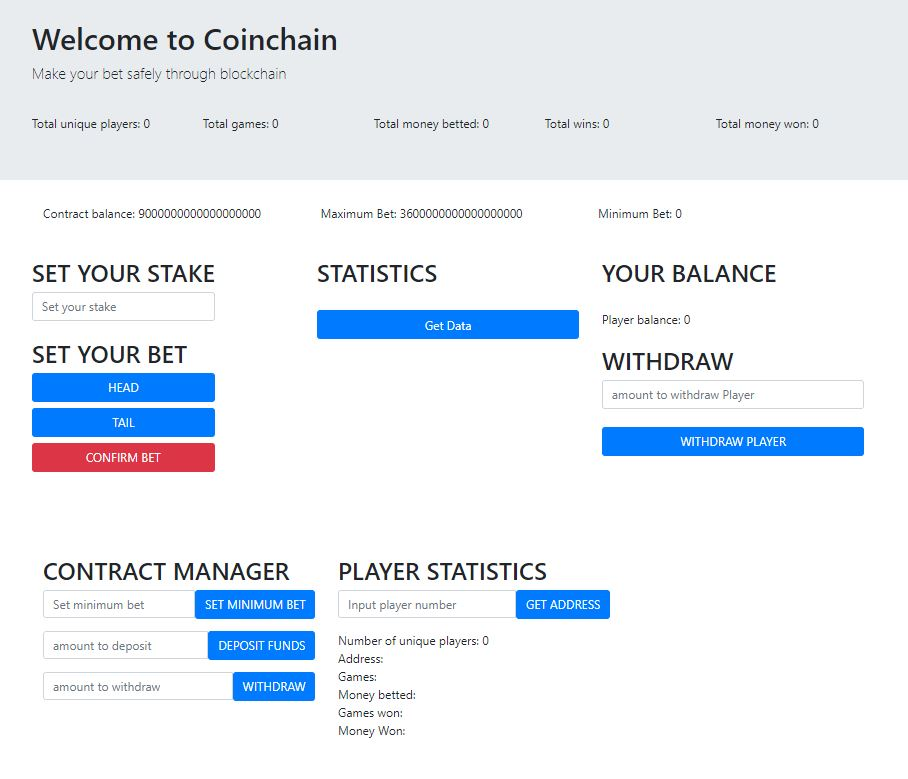

# COIN BET CONTRACT

> bet head or tail in a decentralized solidity contract

### Insert the amount you want to bet (IN WEI), bet on HEAD or TAIL, CONFIRM your bet ###

- On the top of the page you can see the total statistics of all the bet set on the contract
- On the top of the page you can also see the total balance of the contract, the maximum bet and the minimum bet

### Get the last bet result and the total statistic of all your bet ###

### If you win your balance will increase. You can withdraw anytime.  ###
 - if you win you will get the money won on your balance but they will not be trasferred automatically to your account.
 - You need to withdraw the amount to your address manually.
 
 
### If you are the owner of the contract you will see in the dapp some managment buttons ###
 
 
 - You can deposit more funds in the contract
 - You can withdraw funds from the contract
 - You can check the statistics of any player who ever bet on the contract. You will see the total number of unique players.
   You can input the number of the player you want to check. If a player has played more than once you will see the total statistics.
   
   

---

